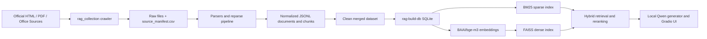

<div align="center">

# CS290S Project 3 RAG

Official-source ShanghaiTech/SIST retrieval-augmented generation data and indexing pipeline.

<p>
  
  
  
  
  
</p>

<p>
  <a href="#why-this-project">Why This Project</a> |
  <a href="#quick-start">Quick Start</a> |
  <a href="#docker-quick-start">Docker Quick Start</a> |
  <a href="#data-pipeline">Data Pipeline</a> |
  <a href="#architecture">Architecture</a> |
  <a href="#development">Development</a>
</p>

</div>

## Latest Status

- **[2026/05]** Added an append-only official-source collection pipeline for ShanghaiTech/SIST data.
- **[2026/05]** Built a clean merged dataset record at `doc/data_collection.md`.
- **[2026/05]** Added SQLite ingestion, BM25/FAISS index builders, and cited retrieval under `src/rag/`.
- **[2026/05]** Added Phase 2 hybrid retrieval with RRF fusion, optional local reranking, trace output, source de-duplication, and packed contexts.
- **[2026/05]** Completed a 12-question retrieval pilot: `hybrid` reached 10/12 expected-source hit@5 versus `dense` at 9/12.
- **[2026/06]** Added local `rag-answer` generation with explicit model paths, citation checks, and evidence-insufficient answers.
- **[2026/06]** Added Docker packaging for the local retrieval and answer runtime.

## Why This Project?

This repository supports the CS290S Project 3 assignment: build a RAG system that answers questions about ShanghaiTech University and the School of Information Science and Technology (SIST) using official sources and self-hosted models.

Key goals:

- Collect evidence from official ShanghaiTech/SIST HTML, PDF, and Office sources.
- Preserve crawl runs as append-only audit artifacts under `data/collection_runs/`.
- Merge accepted outputs into clean JSONL datasets under `data/merged/`.
- Build retrieval-ready SQLite, BM25, and FAISS artifacts under `data/rag/`.
- Run baseline and optimized cited retrieval for representative questions.
- Keep the final generation stack local: no commercial or hosted LLM APIs.

## Quick Start

```bash
# 1. Clone and install
git clone https://github.com/ENNCELADUS/cs290s-project3-RAG.git
cd cs290s-project3-RAG
uv sync --locked --dev

# 2. Verify the collection environment
uv run collect-data doctor --seeds config/official_seed_urls_sist_nav_deep.csv

# 3. Run tests
uv run pytest
```

> Prerequisites: Python `>=3.11,<3.13` and `uv`. OCR fallback uses local Tesseract language data, especially `chi_sim`, when available.

## Docker Quick Start

Use this path when you already received the Docker image, for example `cs290s-rag-phase3.tar`, or the image is already
loaded on the server as `cs290s-rag:phase3`. Runtime data is not bundled into the image; mount the generated RAG
artifacts from `data/rag`.

```bash
# 1. Load the image if you received a tarball
docker load -i cs290s-rag-phase3.tar

# 2. Confirm the image is available
docker image ls cs290s-rag:phase3

# 3. Run a retrieval smoke test against mounted data/rag artifacts
docker run --rm \
  --mount type=bind,source="$PWD/data/rag",target=/home/richard/cs290s-project3-RAG/data/rag,readonly \
  cs290s-rag:phase3 \
  rag-retrieve --query "SIST faculty robotics" --mode bm25 --top-k 2 --json
```

For generated answers, also mount a local Qwen snapshot and the local Hugging Face cache that contains the dense
retrieval model referenced by `data/rag/build_report_2026-05-27.json`:

```bash
docker run --rm \
  --mount type=bind,source="$PWD/data/rag",target=/home/richard/cs290s-project3-RAG/data/rag,readonly \
  --mount type=bind,source=/home/richard/models/Qwen3-0.6B,target=/home/richard/models/Qwen3-0.6B,readonly \
  --mount type=bind,source="$HOME/.cache/huggingface",target=/home/richard/.cache/huggingface,readonly \
  cs290s-rag:phase3 \
  rag-answer --query "SIST faculty robotics" --mode hybrid --top-k 1 \
  --model-path /home/richard/models/Qwen3-0.6B --device cpu --json
```

If your model lives elsewhere, change both the host-side `source=...` path and the `--model-path` inside the command.
If the dense retrieval model is mounted at a path different from the build report path, add
`--dense-model /path/inside/container/to/bge-m3`. CPU mode is enough for smoke tests. GPU mode requires Docker GPU
passthrough to work on the host. After installing the NVIDIA runtime, replace `--device cpu` with `--device cuda` and
add Docker's GPU flag:

```bash
docker run --rm --gpus all ...
```

To share the prepared image from a server:

```bash
docker save cs290s-rag:phase3 -o cs290s-rag-phase3.tar
```

## Data Pipeline

The current collection workflow is documented in [doc/data_collection.md](doc/data_collection.md). The final clean merged dataset path used by default is:

```text
data/merged/all-collection-runs-clean-2026-05-27
```

Representative commands:

```bash
# Run a bounded official-source crawl
uv run collect-data collect \
  --seeds config/official_seed_urls_sist_nav_deep.csv \
  --run-name <run-name> \
  --max-pages 100 \
  --delay 0.5 \
  --skip-known \
  --expand-list-pages

# Reparse an existing run with the current parser
uv run collect-data reparse \
  --source-run data/collection_runs/<source-run> \
  --seeds config/official_seed_urls_sist_nav_deep.csv \
  --run-name <reparse-run>

# Merge an accepted run into a downstream JSONL dataset
uv run collect-data merge \
  --existing-jsonl data/merged/all-collection-runs-clean-2026-05-27 \
  --run-jsonl data/collection_runs/<run-name>/jsonl \
  --output data/merged/<merged-output-name>
```

Each run keeps `source_manifest.csv`, `quality_report.md`, and normalized `jsonl/*.jsonl` outputs for review.

## RAG Indexing

Build the retrieval database and indexes from the clean merged JSONL dataset:

```bash
# Build SQLite tables for documents, chunks, courses, faculty, requirements, and events
uv run rag-build-db

# Build BM25 plus chunk metadata, skipping dense embedding work
uv run rag-build-index --skip-faiss

# Build BM25 and FAISS with the default BAAI/bge-m3 embedding model
uv run rag-build-index --require-cuda
```

Defaults are defined in `src/rag/ingest.py` and `src/rag/index.py`. The default dense embedding model is `BAAI/bge-m3`; BM25 tokenization combines ASCII token matching with `jieba` for Chinese text.

Run cited retrieval against existing artifacts:

```bash
# Baseline sparse retrieval
uv run rag-retrieve --query "深度学习 任课老师" --mode bm25 --top-k 5

# Baseline dense retrieval
uv run rag-retrieve --query "SIST faculty robotics" --mode dense --top-k 5

# Optimized hybrid retrieval with RRF and packed contexts
uv run rag-retrieve --query "SIST faculty robotics" --mode hybrid --top-k 5 --json
```

Hybrid retrieval uses BM25 and FAISS candidates, reciprocal rank fusion, source de-duplication, and structured trace output. Optional reranking requires `--reranker-model` to point to an existing local model path; omitted reranker settings keep the RRF order. The retrieval API and output shapes are documented in [doc/retrieval.md](doc/retrieval.md).

The Phase 2 retrieval pilot is documented in [doc/retrieval_experiments.md](doc/retrieval_experiments.md). For report
language, the official before-optimization retrieval condition is `dense`; the after-optimization condition is
`hybrid`; `bm25` is a diagnostic baseline.

## RAG Answering

Generate local cited answers with an explicit local model snapshot:

```bash
uv run rag-answer \
  --query "SIST faculty robotics" \
  --mode hybrid \
  --model-path /models/hub/snapshots/qwen3-4b-instruct-2507-local \
  --json
```

`rag-answer` supports the official report modes `dense` and `hybrid`. It does not default to a hosted model ID or
download model files at runtime. Missing model paths, unavailable requested CUDA, empty evidence, missing source URLs,
and uncited model text produce explicit errors or evidence-insufficient answers. The generation contract is documented
in [doc/generation.md](doc/generation.md).

## Project Structure

```text
config/                 Seed URL CSVs for official-source collection
data/jsonl/             Existing normalized source data
data/collection_runs/   Append-only crawl and reparse outputs
data/merged/            Clean merged JSONL datasets for indexing
data/rag/               Generated SQLite, BM25, FAISS, and report artifacts
data/eval/              Small evaluation specs; large run logs stay generated
doc/                    Report-facing project notes
src/rag_collection/     Crawler, parsers, structured extraction, merge CLI
src/rag/                SQLite ingestion, indexing, retrieval, and generation runtime
tests/                  Pytest coverage for collection, parsing, merge, indexing
```

## Architecture



The end-to-end stack is tracked in [doc/tech_stack_plan.md](doc/tech_stack_plan.md): Python, JSONL/SQLite metadata, BM25, FAISS, `BAAI/bge-m3`, hybrid RRF retrieval, optional local reranking, local Qwen generation, and a Gradio interface.

## Development

```bash
# Full test suite
uv run pytest

# Focused tests
uv run pytest tests/integration/test_rag_ingest_index.py

# Lint and format
uv run ruff check src tests
uv run ruff format src tests
```

Style is configured in `pyproject.toml`: Python 3.11 target, 120-character lines, and Ruff rules for `E`, `F`, `I`, `UP`, and `B`.

## Configuration and Security

Do not commit raw datasets, model checkpoints, secrets, or generated merged/index artifacts unless explicitly required for submission. The assignment requires self-deployed or locally running models. Do not add OpenAI, Claude, Gemini, DashScope, hosted DeepSeek, Hugging Face hosted inference, or similar hosted LLM calls to the submitted system.

## Contributing

Keep changes scoped to one pipeline stage when possible:

- `rag_collection`: crawling, parsing, quality checks, reparse, and merge behavior.
- `rag`: SQLite ingestion, sparse indexing, dense indexing, retrieval runtime, and retrieval artifacts.
- `doc`: report-facing run records and architecture notes.
- `tests`: small deterministic fixtures using `tmp_path`; avoid tests that require large real datasets or network access.

Before opening a pull request, include the commands run, generated artifacts, and any skipped expensive steps such as dense FAISS embedding.

## License

No license file is currently included in this repository.
