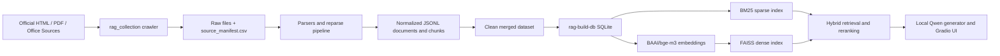

<div align="center">

# CS290S Project 3 RAG

Official-source ShanghaiTech/SIST retrieval-augmented generation data and indexing pipeline.

<p>
  
  
  
  
  
</p>

<p>
  <a href="#why-this-project">Why This Project</a> |
  <a href="#quick-start">Quick Start</a> |
  <a href="#data-pipeline">Data Pipeline</a> |
  <a href="#architecture">Architecture</a> |
  <a href="#development">Development</a>
</p>

</div>

## Latest Status

- **[2026/05]** Added an append-only official-source collection pipeline for ShanghaiTech/SIST data.
- **[2026/05]** Built a clean merged dataset record at `doc/data_collection.md`.
- **[2026/05]** Added SQLite ingestion plus BM25 and FAISS index builders under `src/rag/`.

## Why This Project?

This repository supports the CS290S Project 3 assignment: build a RAG system that answers questions about ShanghaiTech University and the School of Information Science and Technology (SIST) using official sources and self-hosted models.

Key goals:

- Collect evidence from official ShanghaiTech/SIST HTML, PDF, and Office sources.
- Preserve crawl runs as append-only audit artifacts under `data/collection_runs/`.
- Merge accepted outputs into clean JSONL datasets under `data/merged/`.
- Build retrieval-ready SQLite, BM25, and FAISS artifacts under `data/rag/`.
- Keep the final generation stack local: no commercial or hosted LLM APIs.

## Quick Start

```bash
# 1. Clone and install
git clone https://github.com/ENNCELADUS/cs290s-project3-RAG.git
cd cs290s-project3-RAG
uv sync --locked --dev

# 2. Verify the collection environment
uv run collect-data doctor --seeds config/official_seed_urls_sist_nav_deep.csv

# 3. Run tests
uv run pytest
```

> Prerequisites: Python `>=3.11,<3.13` and `uv`. OCR fallback uses local Tesseract language data, especially `chi_sim`, when available.

## Data Pipeline

The current collection workflow is documented in [doc/data_collection.md](doc/data_collection.md). The final clean merged dataset path used by default is:

```text
data/merged/all-collection-runs-clean-2026-05-27
```

Representative commands:

```bash
# Run a bounded official-source crawl
uv run collect-data collect \
  --seeds config/official_seed_urls_sist_nav_deep.csv \
  --run-name <run-name> \
  --max-pages 100 \
  --delay 0.5 \
  --skip-known \
  --expand-list-pages

# Reparse an existing run with the current parser
uv run collect-data reparse \
  --source-run data/collection_runs/<source-run> \
  --seeds config/official_seed_urls_sist_nav_deep.csv \
  --run-name <reparse-run>

# Merge an accepted run into a downstream JSONL dataset
uv run collect-data merge \
  --existing-jsonl data/merged/all-collection-runs-clean-2026-05-27 \
  --run-jsonl data/collection_runs/<run-name>/jsonl \
  --output data/merged/<merged-output-name>
```

Each run keeps `source_manifest.csv`, `quality_report.md`, and normalized `jsonl/*.jsonl` outputs for review.

## RAG Indexing

Build the retrieval database and indexes from the clean merged JSONL dataset:

```bash
# Build SQLite tables for documents, chunks, courses, faculty, requirements, and events
uv run rag-build-db

# Build BM25 plus chunk metadata, skipping dense embedding work
uv run rag-build-index --skip-faiss

# Build BM25 and FAISS with the default BAAI/bge-m3 embedding model
uv run rag-build-index --require-cuda
```

Defaults are defined in `src/rag/ingest.py` and `src/rag/index.py`. The default dense embedding model is `BAAI/bge-m3`; BM25 tokenization combines ASCII token matching with `jieba` for Chinese text.

## Project Structure

```text
config/                 Seed URL CSVs for official-source collection
data/jsonl/             Existing normalized source data
data/collection_runs/   Append-only crawl and reparse outputs
data/merged/            Clean merged JSONL datasets for indexing
data/rag/               Generated SQLite, BM25, FAISS, and report artifacts
doc/                    Report-facing project notes
src/rag_collection/     Crawler, parsers, structured extraction, merge CLI
src/rag/                SQLite ingestion and retrieval index builders
tests/                  Pytest coverage for collection, parsing, merge, indexing
```

## Architecture



The planned end-to-end stack is described in [doc/tech_stack_plan.md](doc/tech_stack_plan.md): Python, JSONL/SQLite metadata, BM25, FAISS, `BAAI/bge-m3`, optional reranking, local Qwen generation, and a Gradio interface.

## Development

```bash
# Full test suite
uv run pytest

# Focused tests
uv run pytest tests/test_rag_ingest_index.py

# Lint and format
uv run ruff check src tests
uv run ruff format src tests
```

Style is configured in `pyproject.toml`: Python 3.11 target, 120-character lines, and Ruff rules for `E`, `F`, `I`, `UP`, and `B`.

## Configuration and Security

Do not commit raw datasets, model checkpoints, secrets, or generated merged/index artifacts unless explicitly required for submission. The assignment requires self-deployed or locally running models. Do not add OpenAI, Claude, Gemini, DashScope, hosted DeepSeek, Hugging Face hosted inference, or similar hosted LLM calls to the submitted system.

## Contributing

Keep changes scoped to one pipeline stage when possible:

- `rag_collection`: crawling, parsing, quality checks, reparse, and merge behavior.
- `rag`: SQLite ingestion, sparse indexing, dense indexing, and retrieval artifacts.
- `doc`: report-facing run records and architecture notes.
- `tests`: small deterministic fixtures using `tmp_path`; avoid tests that require large real datasets or network access.

Before opening a pull request, include the commands run, generated artifacts, and any skipped expensive steps such as dense FAISS embedding.

## License

No license file is currently included in this repository.
