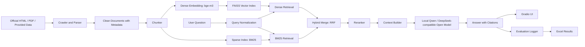

# Project 3 RAG Tech Stack Plan

Last updated: 2026-05-26

## Scope and Constraints

This project builds a Retrieval-Augmented Generation system for questions about ShanghaiTech University and SIST. The implementation must support:

- official-source data collection from HTML, PDF, and plain text;
- preprocessing, cleaning, chunking, embedding, retrieval, and generation;
- an interactive web UI that shows the answer and retrieved source context;
- at least 50 evaluation questions and an Excel result sheet comparing pre-optimization and post-optimization outputs;
- deployment on AIStation or an equivalent self-managed server.

The project explicitly requires self-deployed or locally running models. Do not use commercial or hosted LLM APIs for the final system. A local API server is acceptable only if it serves a self-hosted model, for example a `vLLM` or `transformers` service running on the project GPU server.

Existing local data state:

- `data/raw`: 2401 files, about 274 MB.
- `data/texts`: 2365 extracted text files, about 19 MB.
- `data/sist_kb.sqlite`: existing structured knowledge base.
- `data/SIST_OVERVIEW.md`: summarizes 2566 SIST documents, 23146 chunks, 2110 course rows, 103 faculty rows, and other extracted entities.

## Recommended Stack

| Layer | Choice | Role |
| --- | --- | --- |
| Language | Python | Best-supported ecosystem for RAG, embeddings, vector search, local LLM inference, and Gradio deployment. |
| Environment | `uv` or `pip` + pinned requirements | Keep the AIStation setup reproducible. |
| Data parsing | `BeautifulSoup4`, `trafilatura`, `pdfplumber` or `PyMuPDF` | Extract clean text from official web pages and PDFs while preserving source metadata. |
| Intermediate data | JSONL chunks + SQLite metadata | JSONL is easy to rebuild and inspect; SQLite keeps sources, chunks, entities, and evaluation logs queryable. |
| Dense embedding | `BAAI/bge-m3` | Multilingual embedding model suitable for Chinese and English university content. |
| Vector search | FAISS, exact inner-product index for baseline | The dataset is small enough for exact search; FAISS is simple to save/load and easy to explain in the report. |
| Sparse search | BM25 with Chinese tokenization | Improves exact matching for course names, faculty names, program names, credits, and dates. |
| Reranker | `BAAI/bge-reranker-v2-m3` or `Qwen/Qwen3-Reranker-0.6B` | Rerank hybrid candidates; this is the clearest accuracy optimization for the report. |
| Generator | `Qwen/Qwen3-4B-Instruct-2507` baseline; `Qwen/Qwen3-30B-A3B-Instruct-2507` if GPU testing passes | Both are local open-source options. Use 4B for a stable demo, then test 30B-A3B for better answer quality. |
| Frontier experiment | `deepseek-ai/DeepSeek-V4-Flash` only if self-hosted and fits resources | Optional experiment. Do not call DeepSeek hosted API in the submitted system. |
| Inference server | Start with `transformers`; switch to `vLLM` if latency matters | `transformers` is easier to debug; `vLLM` is better for serving once the pipeline is stable. |
| UI | Gradio `Blocks` or `ChatInterface` | Minimal web app with answer, source snippets, scores, and source URLs. |
| Evaluation | `pandas`, `openpyxl`, JSONL run logs | Directly produces the required Excel columns and repeatable before/after comparisons. |

## System Architecture



## Baseline and Optimization Plan

Baseline retrieval:

1. Convert every cleaned chunk into a dense vector with `BAAI/bge-m3`.
2. Store vectors in a FAISS index and chunk metadata in SQLite/JSONL.
3. Retrieve top-k chunks by dense similarity.
4. Prompt the local Qwen model with the retrieved context.
5. Return the answer plus source snippets.

Optimization:

1. Retrieve top candidates from FAISS and BM25 separately.
2. Merge candidates with reciprocal rank fusion.
3. Rerank merged candidates with `BAAI/bge-reranker-v2-m3` or `Qwen/Qwen3-Reranker-0.6B`.
4. Keep the best 6-8 chunks, with token-budget-aware context packing.
5. Compare pre-optimization and post-optimization accuracy, retrieval hit rate, and latency.

This optimization is report-friendly because it directly targets common failure cases:

- dense retrieval misses exact course codes or faculty names;
- BM25 misses semantic paraphrases;
- top-k retrieval includes many near-duplicate chunks;
- the generator hallucinates when context is weak or too long.

## Local LLM Deployment Policy

Allowed:

- loading a Hugging Face model checkpoint with `transformers`;
- serving a downloaded open-source model with `vLLM`, Text Generation Inference, or a custom FastAPI wrapper;
- exposing a local OpenAI-compatible endpoint backed by the self-hosted model.

Not allowed for the submitted system:

- OpenAI, Claude, Gemini, DashScope, DeepSeek hosted API, Hugging Face hosted inference, Together, Fireworks, or any other third-party hosted LLM API;
- using commercial APIs for evaluation answers unless clearly excluded from the final system and report metrics.

Recommended deployment sequence:

1. Build the pipeline with `transformers` and `Qwen/Qwen3-4B-Instruct-2507`.
2. Verify retrieval quality and prompt format on 10-20 smoke questions.
3. Run the 50+ question evaluation set.
4. Add hybrid retrieval plus reranking.
5. If GPU memory and latency allow, test `Qwen/Qwen3-30B-A3B-Instruct-2507` or `DeepSeek-V4-Flash` as an optional generator upgrade.

## Suggested Repository Layout

```text
data/
  raw/                  # existing raw crawl/PDF/HTML files; do not zip into final submission
  texts/                # extracted text files
  jsonl/                # normalized documents/chunks
  sist_kb.sqlite        # structured metadata and facts
doc/
  tech_stack_plan.md    # this plan
src/
  rag/
    ingest.py
    clean.py
    chunk.py
    embed.py
    retrieve.py
    rerank.py
    generate.py
    app.py
eval/
  questions.xlsx
  run_eval.py
  results_before_after.xlsx
```

## Prompt Shape

Use a conservative citation-first prompt:

```text
You are a ShanghaiTech/SIST QA assistant.
Answer only using the provided context.
If the context is insufficient, say that the current knowledge base does not contain enough evidence.
Return a concise answer in the same language as the question.
Include source titles or URLs after the answer.

Question:
{question}

Context:
{ranked_context}
```

## Documentation and Model Links

- Project instructions: [project3.md](../project3.md)
- Local SIST data summary: [data/SIST_OVERVIEW.md](../data/SIST_OVERVIEW.md)
- FAISS documentation: <https://github.com/facebookresearch/faiss/wiki>
- Sentence Transformers documentation: <https://www.sbert.net/>
- Gradio documentation: <https://www.gradio.app/>
- Hugging Face Transformers chat templates: <https://huggingface.co/docs/transformers/chat_templating>
- Hugging Face Transformers chat basics: <https://huggingface.co/docs/transformers/conversations>
- `BAAI/bge-m3`: <https://hf.co/BAAI/bge-m3>
- `BAAI/bge-reranker-v2-m3`: <https://hf.co/BAAI/bge-reranker-v2-m3>
- `Qwen/Qwen3-4B-Instruct-2507`: <https://hf.co/Qwen/Qwen3-4B-Instruct-2507>
- `Qwen/Qwen3-30B-A3B-Instruct-2507`: <https://hf.co/Qwen/Qwen3-30B-A3B-Instruct-2507>
- `Qwen/Qwen3-Reranker-0.6B`: <https://hf.co/Qwen/Qwen3-Reranker-0.6B>
- `deepseek-ai/DeepSeek-V4-Flash`: <https://hf.co/deepseek-ai/DeepSeek-V4-Flash>
- `deepseek-ai/DeepSeek-V4-Pro`: <https://hf.co/deepseek-ai/DeepSeek-V4-Pro>

## Open Decisions

- Choose the final generator after AIStation testing: stable `Qwen3-4B`, stronger `Qwen3-30B-A3B`, or optional self-hosted DeepSeek V4 Flash.
- Decide whether SQLite remains metadata-only or also stores normalized chunks.
- Decide whether the final UI should expose advanced retrieval diagnostics or only answer + sources.
- Define the exact 50+ question set and ground-truth evidence sources before optimizing, so the before/after comparison is credible.
